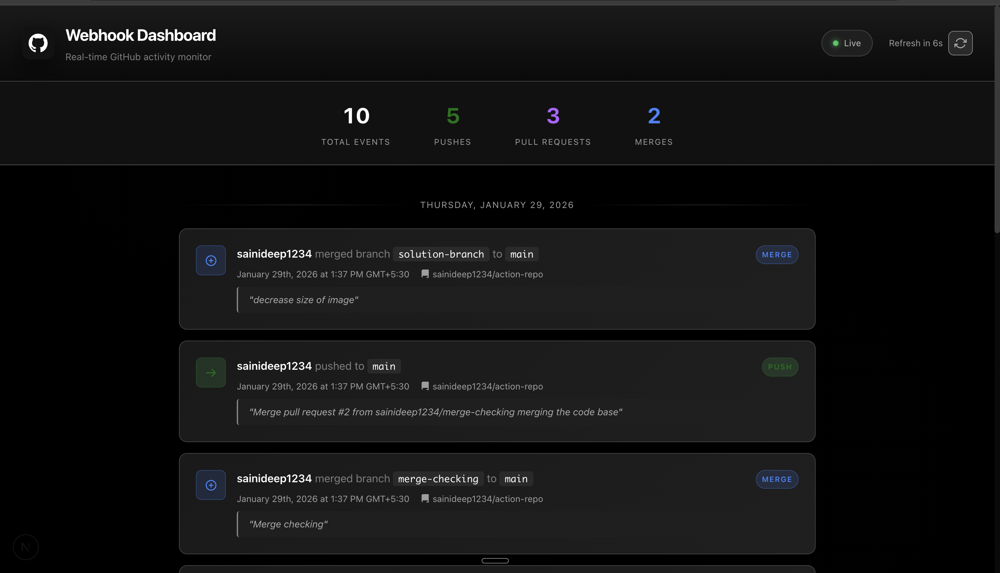

# GitHub Webhook Dashboard

A Flask + Next.js application that captures GitHub webhook events (Push, Pull Request, Merge), stores them in MongoDB, and displays them in a real-time dashboard with 15-second polling.

---



## Quick Setup

### Prerequisites
- Python 3.10+
- Node.js 18+
- Docker Desktop
- ngrok (`brew install ngrok`)

### 1. Start MongoDB
```bash
docker compose up -d
```

### 2. Run Backend (Terminal 1)
```bash
cd tsk-public-assignment-webhook-repo
source venv/bin/activate
pip install -r requirements.txt
python run.py
```

### 3. Run Frontend (Terminal 2)
```bash
cd frontend
npm install
npm run dev
```

### 4. Expose with ngrok (Terminal 3)
```bash
ngrok http 5000
```
Copy the **Forwarding URL** (e.g., `https://abc123.ngrok-free.app`)

### 5. Configure GitHub Webhook
1. Go to your GitHub repo → **Settings** → **Webhooks** → **Add webhook**
2. **Payload URL**: `https://YOUR-NGROK-URL/webhook/github`
3. **Content type**: `application/json`
4. **Events**: Select "Send me everything" or specific events
5. Click **Add webhook**

---

**Dashboard**: http://localhost:3000
